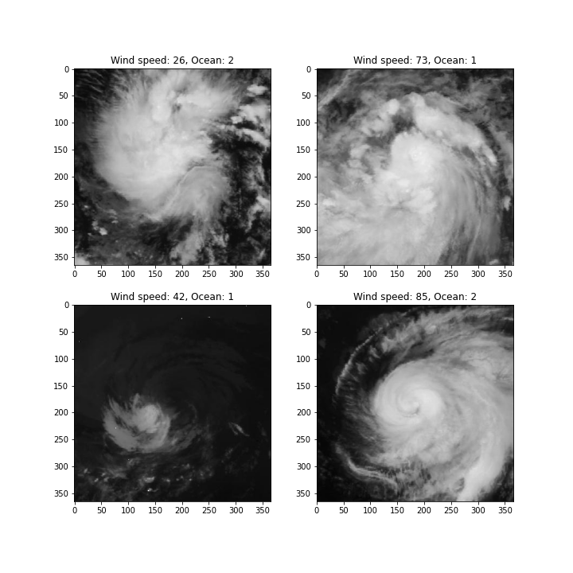
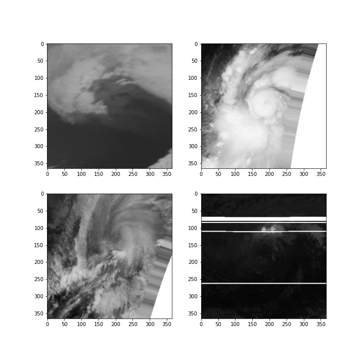

# Wind Speed Prediction 

This repo shows my result in the competition named: ["Wind-dependent Variables: Predict Wind Speeds of Tropical Storms"](https://www.drivendata.org/competitions/72/predict-wind-speeds/).

I ranked 35th out of 733 participants. My best model reach 8.98 in public score and 8.6794 in private score. (The score was measured by Root mean square error, see details below for more information).

<figcaption>
Fig 1. Some samples from data.
</figcaption>

**Challenge overview:**

* The challenge provides a set of $366\times366$ resolution images of the storm was captured by satellie (provided by NASA if I am correct) from two different Ocean. Besides that, they give us the metadata which contain the ocean each image belong to and the time they captured it. Figure 1 shows some examples. The metadata is clean, there is no missing information.
* They required the participants to predict the speed of the wind and the evaluation metric will be Root Mean Square Error. Call the ground truth is $\hat{y_i}$ and the regression result from our model is $y_i$, the formula will be:

$$RMSE=\sqrt{\frac{1}{N}\sum^N_{i=0}(y_i-\hat{y_i})^2} \text{[1]}$$ 

<figcaption>
Fig 2. Some defect samples from data.
</figcaption>

**Problem with datasets:**

* Easiest problem I can figure out is the image defect, there are some image or even all images in a storm meet the same defect. Figure 2 shows the most common defects in this dataset images:
  * The top left shows that sometime the resolution of image is lower than usual
  * The top right shows some missing information in image.
  * The bottom left shows the combination of two defects above.
  * The bottom right shows the random white lines with random number of lines.
* Back to Figure 1, since I saw that the wind speed and image look nearly the same between two ocean which means add ocean to my model maybe cause the bad effect to it. Therefore, I ignored the ocean feature.

**Data augmentations:** those images are gray images, however, I decided to treat them as RGB images since I used pre-trained weight from ImageNet which was trained by RGB images. Even this data is not balance (wind speed: 50% around 30, 30% around 54, and 20% around 95 - know this by exponential idea below), I decided to use soft augmentation just to act as the regularization. For training, the augmentation that I used are:

* Verticle Flip
* Horizontal Flip
* One Of those filter:
  * Gaussian Blur
  * Gaussian Noise
  * Median Blur

For both training and evaluation, I use these augments:

* Center Crop - Observe that the important information always lie in the center, so I decide I will crop instead of resize as usual for image which have the resolution smaller than 366. For any model required the bigger resolution, I still keep input is 366.
* Normalize with ImageNet mean and std.

### My solution

1. The simplest way is transfer learning which means I take a model and the pretrained from ImageNet and replace the last layer to be adapted with my problem. At first, I tried to add several Dense layers with Dropout and activate function (LeakyReLU or Swish), after researched some first ranked solution from Kaggle, I decided to use only one Dense layer to get the final output.

Model for first solution:

* ResNet50
* ResNet101
* Squeeze ResNext101-32x4d
* EfficientNet B5
* EfficientNet B7

2. Next idea, I think about the object detection task which contain the regression part in there. Inspired by YOLO - my favourite object detection model - I defined the anchor and try to predict the exponential scale factor ($t$ parameter in formula below):

$$speed = anchor\times \exp(t)\text{[2]}$$ 

The anchor here I take the mean of all wind speed which equal to $50.344$.

Model for second solution:

* Squeeze ResNext101-32x4d

3. The lowest wind is $15$ and highest is $185$ which means in equation $[2]$,  $t\in [-1.21, 1.30]$. I think its range is too wide and hard to scale with one anchor only. So I decided to find three clusters which will represent for three common wind speed in different level based on how they find the cluster for bounding box in YOLO (you can find the code in [notebook](./notebook))